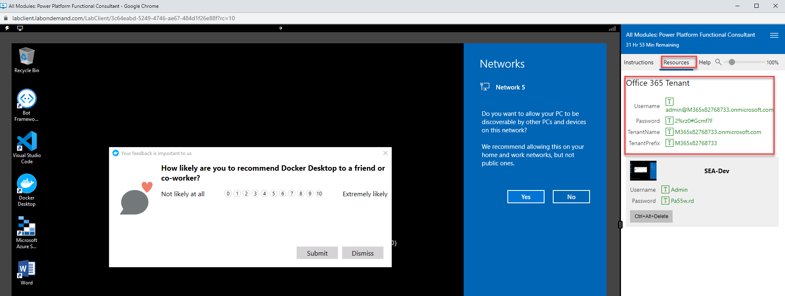
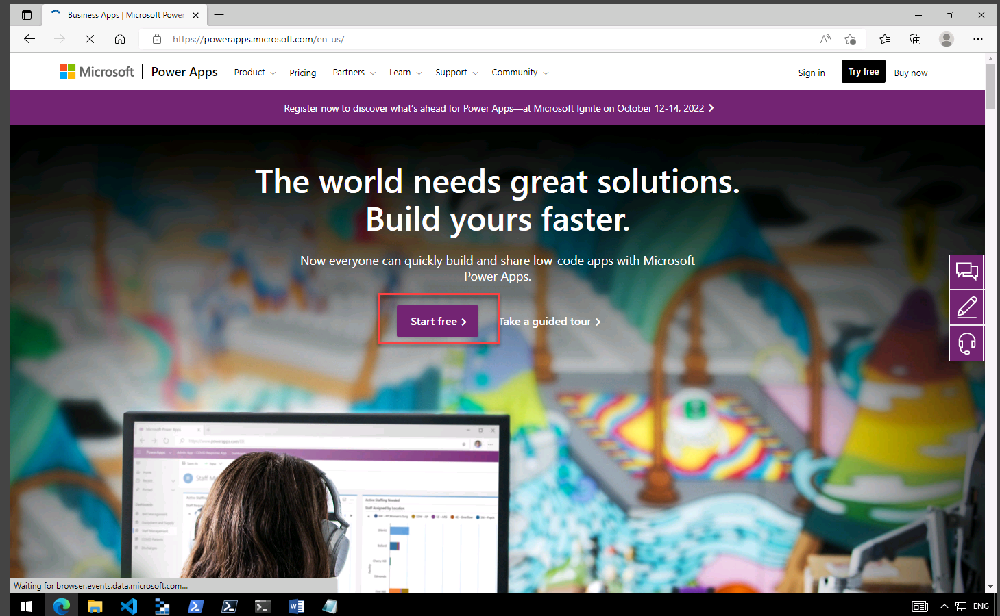
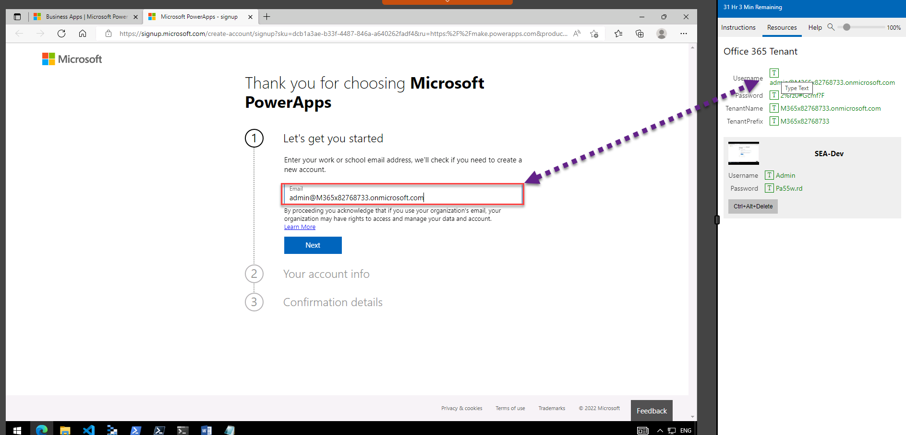
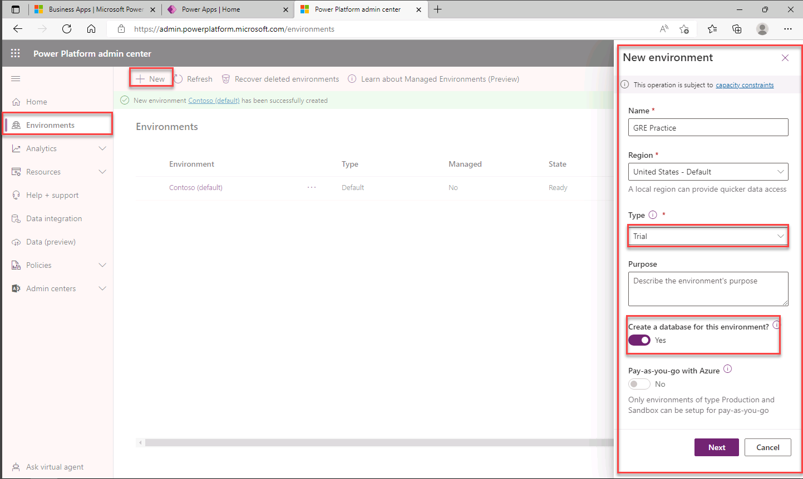
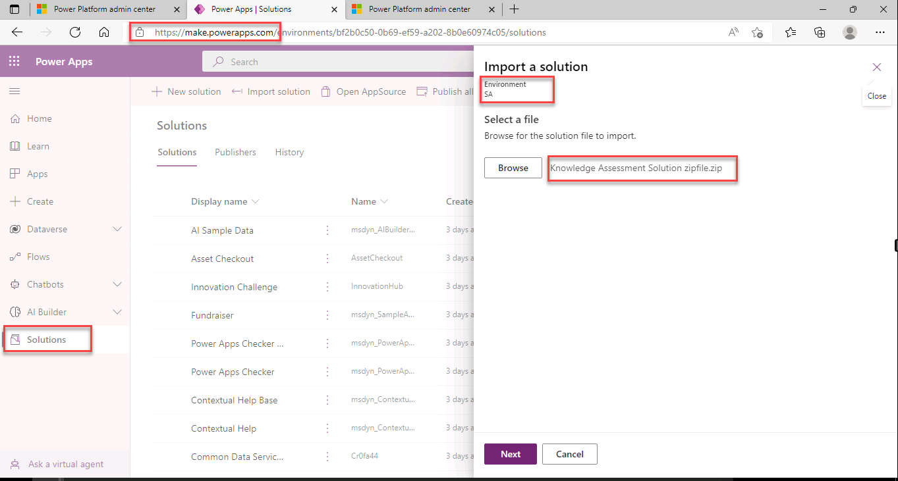

---
lab:
    title: 'Lab 1: Setup Lab'
    module: 'Module 1: Introduction to Microsoft Power Platform'
---

Module 1: Introduction to Microsoft Power Platform 
=================================

## Practice Lab – Validate lab environment

### Important Notice (Effective November 2020):
Common Data Service has been renamed to Microsoft Dataverse. Some terminology in Microsoft Dataverse has been updated. For example, entity is now table and field is now column. 

While the application is in the process of updating its user experience, some references to terminology like the Common Data Service (now **Dataverse**), entity (now **table**), field (now **column**), and record (now **row**) may be out of date. Please keep this in mind as you work through the labs. We expect to have our content fully up to date very soon. 

For more information and for a complete list of affected terms, please visit [What is Microsoft Dataverse?](https://docs.microsoft.com/en-us/powerapps/maker/common-data-service/data-platform-intro#terminology-updates)

## Scenario

In this Module 1 lab, you will acquire a Power Platform trial tenant and access
the Microsoft Power Platform admin center. In the admin center, we will create an
individual environment for configuration during the course.

## ALL EXERCISES ARE TO BE COMPLETED IN THE VIRTUAL MACHINE PROVIDED BY SKILLABLE (OR OTHER HOSTING PROVIDER)

## Exercise 1 – Acquire your Microsoft Power Platform trial tenant

1. Ensure you have downloaded the neccessary files from **GITHUB** by clicking the blue button to download the files. Ask your instructor if you need additional support to do this.

1.  Your **Microsoft 365 credentials** from the Authorized Lab Hoster can be found underthe  **Resources** tab of the lab computer. (Next to the instructions tab)

2.  Navigate to <https://powerapps.microsoft.com/> in a web browser. Edge is installed on the Lab VM. PLease use the Edge Browser

3.  Click **Start free.** It is the big purple button in the middle of the screen

4.  Under **Let's get you started** page, enter the email address from your Microsoft 365
    credentials in the text box that says **Enter your work email address.**. Then 
    click **Next**. 

5.  You will see a prompt that you have an existing account with Microsoft.
    Select **Sign in.**

6.  Enter the password provided by the Authorized Lab Hoster. Click **Sign in.**

7.  At the **Almost there** prompt, click **Start.**

    **Note:** Depending on your internet browser, you may be prompted to sign in
    again. Select **Sign in**, click the email account you just signed in with,
    and continue. You may also be prompted to provide more information. Enter
    1234567890 in the Phone number field, and click **Get started**.

8.  Select **Yes** to stay signed in. On the page that shows **You're all set**,
    click **Get started**.
    
    **Note:** If you get a **Sorry, there's been a disconnect** error message then try to refresh the page. 

## Exercise 2 - Create your environment

In this exercise, you will create your **Practice** environment that you will
do the majority of your lab work in.

### Task 1 – Create environment

1.  Navigate to <https://admin.powerplatform.com> and log in with your Microsoft 365 credentials if prompted again.

2.  If you are not automatically directed there, select **Environments** from the left navigation pane and
    click **+New.**

    -   For **Name**, enter **[my initials] Practice.** (Example: AJ Practice.)

    -   For **Type**, select **Trial.** DO NOT SELECT the option for **Trial
        (subscription-based)** - select the option that only says **Trial.** It is the last option in the list

    -   Change the **Create a database for this environment?** toggle to
        **Yes.**

    -   Leave all other selections as default and click **Next.**

    -   On the next tab, change the toggle for **Deploy sample apps and data?**
        to **Yes.** Click **Save**.
        

3.  Your **Practice** environment should now show in the list of Environments.

4.  Your environment may take a few minutes to provision. Refresh the page if
    needed. When your environment is prepared, select your **Practice**
    environment by clicking on the ellipses next to its name to expand the drop
    down menu and select **Settings.**

5.  Explore the different areas in **Settings** that you are interested in but
    do not make any changes yet.

**NOTE** Depending on the browser that you are using, it is suggested that you
disable any pop-up blockers that maybe enabled. This will prevent popup screens
from not appearing as they should.

## Exercise 3 - Import the Knowledge Assessment Solution

In this excerise we will import the Knowledge Assessment Solution that conatins the two Power Apps needs to implement the assessment enviornment

1.  In the lab machine. on the very first instruction page there blue button called **Download Lab Files** please click that button and wait for the lab files to download from github.

2.  Navigate to <https://make.powerapps.com>. You will likely have this open from excercise 1. It will be a tab in your browswer

3.  Make sure you are in the **Practice** environment you created. You will find the enviornment in the top right-hand corner of the screen.

4.  Select **Solutions** from the left-hand menu. Its the last option in the list

4. Select **<--| Import solution** which you will find at the top menu of the screen

5. Click **Browse** and navigate to *F:\Allfiles\Labs* 

6. Click on **Knowledge Assessment Solution Zipfile.zip** and click **Open**

7. Click **Next**

8. Click **Import** the import can take several minutes. We will move on with the taught material once this has been completed
